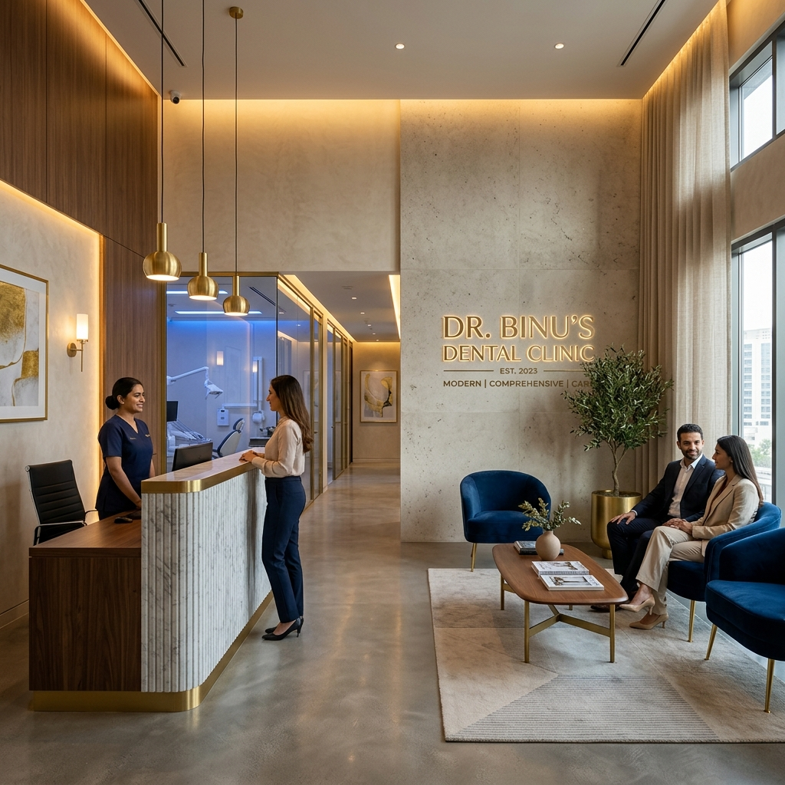

# Dr. Binu's Dental Clinic - Premium Marketing Platform



An ultra-premium, cinematic marketing website for **Dr. Binu's Dental Clinic**. Designed to deliver a state-of-the-art digital experience that matches the clinic's high-end, luxury-branded dental boutique environment.

## ✨ Key Features

- **Luxury Branding**: Sleek dark mode and gold-accented palette inspired by the clinic's premium identity.
- **Intelligent Service Grid**: A dynamic treatment showcase featuring an interactive "Show More" reveal that optimizes horizontal space.
- **"Meet the Doctors" Section**: A high-impact, 3-column layout showcasing specialists with luxury photo boxes and zoom-on-hover effects.
- **3D Treatment Visualization**: Highlighted procedures (Root Canal, Laser Surgery) presented through advanced visual storytelling.
- **Modern Performance**: Zero-backend, pure frontend architecture for lightning-fast loading and seamless navigation.
- **Fully Responsive**: Optimized for everything from ultra-wide monitors to the latest mobile devices.

## 🛠️ Tech Stack

- **Core**: HTML5, CSS3, JavaScript (Vanilla)
- **Styling**: Modern CSS Grid & Flexbox, Custom Luxury UI Components
- **Fonts**: Google Fonts (Playfair Display & Inter)
- **Animations**: Intersection Observer API for scroll-triggered reveal effects.

## 🚀 Getting Started

### Prerequisites
To run the project locally, you simply need a browser. If you wish to use the built-in development server:
- [Node.js](https://nodejs.org/) (optional)

### Installation
1. Clone the repository:
   ```bash
   git clone https://github.com/melvin-ph/binus_clinic.git
   ```
2. Navigate to the project directory:
   ```bash
   cd "Dental Clinic"
   ```
3. Open `public/index.html` in your browser, or run the dev server:
   ```bash
   npm start
   ```

## 🎨 Design Philosophy
The website focuses on **Rich Aesthetics** and **Premium UX**:
- **Glassmorphism**: Subtle translucent effects on navigation and overlays.
- **Micro-animations**: Interactive elements that feel "alive" and responsive.
- **Visual Excellence**: Curated harmonious color palettes and premium typography.

## 📄 License
This project is for demonstration and marketing purposes for Dr. Binu's Dental Clinic.

---
*Created with focus on visual excellence and performance.*
